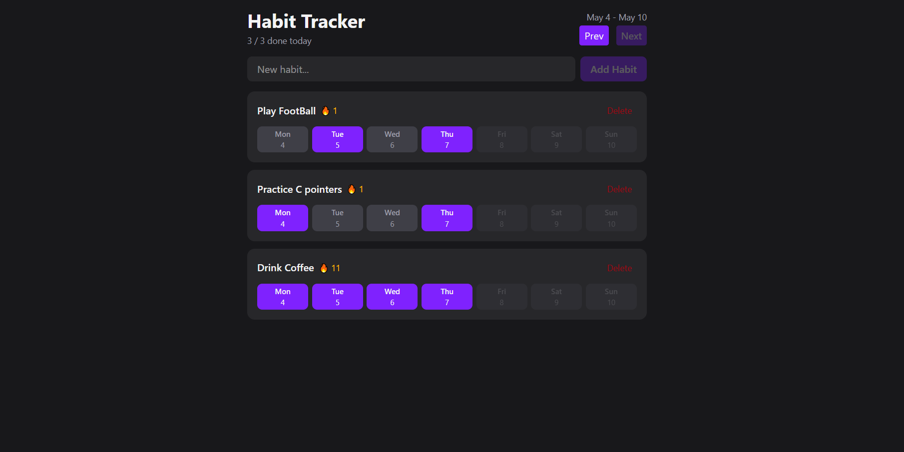

# Habit Tracker

A clean and modern habit tracking app built with React and TypeScript.  
Track your daily habits, build streaks, and stay consistent with a simple weekly overview.

---

## Preview

---

## Features

- Add new habits
- Delete habits
- Track daily completions
- Weekly habit overview
- Streak counter 🔥
- Clean dark UI
- Responsive layout
- Built with reusable React components

---

## Tech Stack

- React
- TypeScript
- Vite
- Tailwind CSS

---

## What I Practiced

This project helped me practice:

- React component structure
- Props and state management
- Context API
- TypeScript types
- Reusable UI components
- Tailwind styling
- Project organization

---
